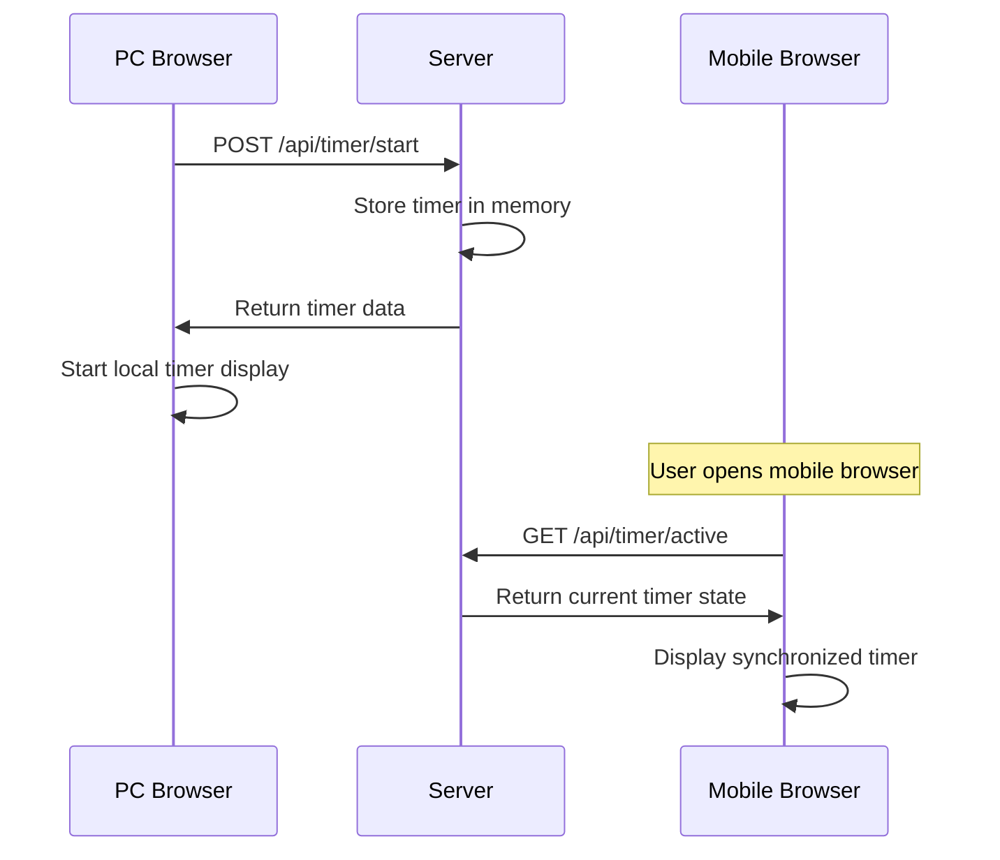
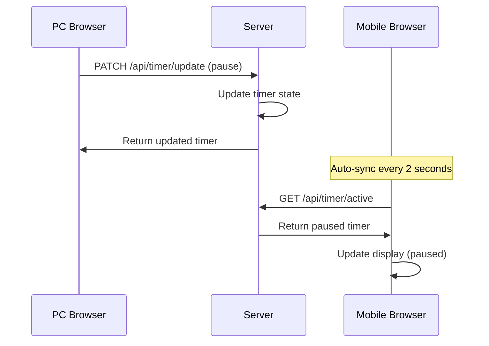
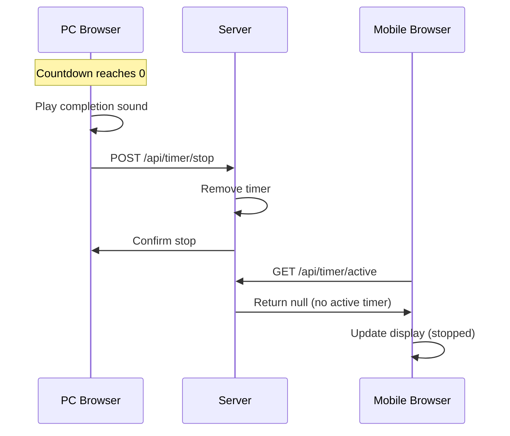

# Timer Synchronization System

This document explains the timer synchronization system implemented in TimeTrackPro to ensure timers are synced across all devices and browsers.

## Problem Solved

**Before**: Timers were stored locally in each browser's localStorage, causing:
- ❌ Timers not syncing between PC and mobile
- ❌ Timer state lost when switching devices
- ❌ No real-time updates across devices
- ❌ Inconsistent timer data

**After**: Timers are synchronized server-side, providing:
- ✅ Real-time sync across all devices
- ✅ Timer state preserved when switching devices
- ✅ Consistent timer data everywhere
- ✅ Automatic cleanup of expired timers

## Architecture

### Server-Side Components

#### 1. Active Timers Management (`server/active-timers.ts`)
```typescript
// In-memory storage for active timers
const activeTimers: Map<number, ActiveTimer> = new Map();

// Key functions:
- setActiveTimer(userId, timer)     // Start/update timer
- removeActiveTimer(userId)         // Stop timer
- getActiveTimer(userId)           // Get user's timer
- updateTimerState(userId, updates) // Update timer state
- getTimerWithElapsedTime(userId)  // Get timer with calculated time
- cleanupExpiredTimers()           // Clean up expired timers
```

#### 2. API Endpoints (`server/teams-simple.ts`)
```http
GET    /api/timer/active     # Get user's active timer
POST   /api/timer/start      # Start new timer
PATCH  /api/timer/update     # Update timer state (pause/resume)
POST   /api/timer/stop       # Stop timer
```

### Client-Side Components

#### 1. Synchronized Timer Hook (`client/src/hooks/use-synced-timer.tsx`)
```typescript
const {
  seconds,           // Current timer seconds
  isRunning,         // Timer running state
  isPaused,          // Timer paused state
  isCompleted,       // Timer completed state
  start,             // Start timer function
  pause,             // Pause timer function
  resume,            // Resume timer function
  stop,              // Stop timer function
  formatTime         // Format time display
} = useSyncedTimer({
  autoSync: true,        // Auto-sync with server
  syncInterval: 2000     // Sync every 2 seconds
});
```

#### 2. Synchronized Time Tracker Component (`client/src/components/synced-time-tracker.tsx`)
- Replaces the old `TimeTracker` component
- Uses server-synchronized timer state
- Provides real-time updates across devices
- Handles timer completion and notifications

## How It Works

### 1. Timer Start Process


### 2. Real-Time Synchronization


### 3. Timer Completion


## API Reference

### GET /api/timer/active
Get the current user's active timer.

**Response:**
```json
{
  "userId": 1,
  "topicId": 2,
  "description": "Working on project",
  "startTime": "2025-10-01T12:00:00.000Z",
  "duration": 1800,
  "isCountDown": true,
  "elapsedSeconds": 120,
  "remainingSeconds": 1680
}
```

### POST /api/timer/start
Start a new timer.

**Request:**
```json
{
  "topicId": 2,
  "description": "Working on project",
  "duration": 1800,
  "isCountDown": true
}
```

**Response:**
```json
{
  "userId": 1,
  "topicId": 2,
  "description": "Working on project",
  "startTime": "2025-10-01T12:00:00.000Z",
  "duration": 1800,
  "isCountDown": true
}
```

### PATCH /api/timer/update
Update timer state (pause/resume).

**Request:**
```json
{
  "isRunning": false,
  "isPaused": true
}
```

### POST /api/timer/stop
Stop the current timer.

**Response:**
```json
{
  "success": true,
  "message": "Timer stopped"
}
```

## Usage Examples

### Basic Timer Usage
```typescript
import { useSyncedTimer } from '@/hooks/use-synced-timer';

function MyTimer() {
  const {
    seconds,
    isRunning,
    isPaused,
    start,
    pause,
    resume,
    stop,
    formatTime
  } = useSyncedTimer();

  return (
    <div>
      <div>{formatTime(seconds)}</div>
      {!isRunning ? (
        <button onClick={() => start(1, "Working", 1800, true)}>
          Start 30min Timer
        </button>
      ) : (
        <div>
          <button onClick={isPaused ? resume : pause}>
            {isPaused ? 'Resume' : 'Pause'}
          </button>
          <button onClick={stop}>Stop</button>
        </div>
      )}
    </div>
  );
}
```

### Advanced Timer with Auto-Sync
```typescript
const timer = useSyncedTimer({
  autoSync: true,        // Enable auto-sync
  syncInterval: 1000     // Sync every second
});

// Timer automatically syncs across devices
// No additional code needed for synchronization
```

## Features

### 1. Real-Time Synchronization
- **Auto-Sync**: Timers automatically sync every 2 seconds
- **Cross-Device**: Works between PC, mobile, and any browser
- **State Preservation**: Timer state maintained when switching devices

### 2. Timer Types
- **Regular Timer**: Counts up from 0
- **Countdown Timer**: Counts down to 0 with completion notification
- **Pause/Resume**: Timer can be paused and resumed
- **Stop/Reset**: Timer can be stopped and reset

### 3. Error Handling
- **Network Errors**: Graceful handling of connection issues
- **Sync Conflicts**: Server state takes precedence
- **Expired Timers**: Automatic cleanup of expired timers

### 4. Performance
- **Efficient**: Only syncs when necessary
- **Lightweight**: Minimal server memory usage
- **Fast**: Sub-second response times

## Migration Guide

### From Old Timer System
1. **Replace Component**: Use `SyncedTimeTracker` instead of `TimeTracker`
2. **Update Imports**: Import from new synchronized components
3. **Remove Local Storage**: No need for localStorage timer state
4. **Update Pages**: Replace timer components in dashboard and time entries pages

### Code Changes
```typescript
// Before
import { TimeTracker } from "@/components/time-tracker";

// After
import { SyncedTimeTracker } from "@/components/synced-time-tracker";
```

## Testing

### Manual Testing
1. **Start Timer**: Open app in browser, start a timer
2. **Open Mobile**: Open app on mobile device
3. **Verify Sync**: Timer should show same time and state
4. **Pause on PC**: Pause timer on PC
5. **Check Mobile**: Mobile should show paused state
6. **Resume on Mobile**: Resume on mobile
7. **Check PC**: PC should show resumed state

### Automated Testing
```bash
# Test timer endpoints
node test-timer-sync.js

# Test synchronization
# 1. Start timer in browser A
# 2. Check timer in browser B
# 3. Verify they match
```

## Troubleshooting

### Common Issues

1. **Timer Not Syncing**
   - Check network connection
   - Verify authentication
   - Check browser console for errors

2. **Timer State Inconsistent**
   - Refresh the page
   - Check server logs
   - Verify API endpoints are working

3. **Timer Not Starting**
   - Check if user is authenticated
   - Verify topic is selected
   - Check server response

### Debug Steps

1. **Check Network Tab**: Look for API calls to `/api/timer/*`
2. **Check Console**: Look for JavaScript errors
3. **Check Server Logs**: Look for timer-related logs
4. **Test Endpoints**: Use curl or Postman to test API

## Benefits

### For Users
- ✅ **Seamless Experience**: Timer works the same on all devices
- ✅ **No Data Loss**: Timer state preserved when switching devices
- ✅ **Real-Time Updates**: See timer changes instantly across devices
- ✅ **Reliability**: Server-side storage is more reliable than localStorage

### For Developers
- ✅ **Centralized State**: Single source of truth for timer data
- ✅ **Easy Debugging**: Server logs show all timer operations
- ✅ **Scalable**: Can be extended for team timers and collaboration
- ✅ **Maintainable**: Clean separation of concerns

## Future Enhancements

- **Team Timers**: Share timers with team members
- **Timer History**: Track timer usage over time
- **Notifications**: Push notifications for timer events
- **Analytics**: Timer usage analytics and insights
- **Offline Support**: Work offline and sync when online
